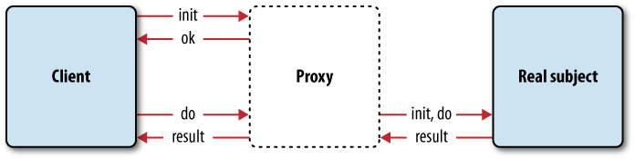
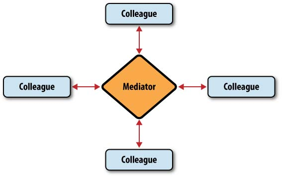

# JavaScript Patterns

#### These are some rough notes I took while reading the book JavaScript Patterns by Stoyan Stefanov. It's a really great book - concise yet packed with info!

## Ch 2. Essentials

### Single Var

* You use one var statement and declare multiple variables delimited by commas. 
* It’s a good practice to also initialize the variable with an initial value at the time you declare it. 
* This can prevent logical errors (all uninitialized and declared variables are initialized with `undefined`)

```javascript
function fn() {  
	var a = 1,
      b = 2,
      sum = a + b,
      myobject = {},
      i,
      j;

  // function body...
}
```

### `for` Loop Declarations

* A problem with the typical pattern is that the length of the array is accessed on every loop iteration. 
* This can slow down your code, especially when the array is not an array but an `HTMLCollection` object (ie, objects returned by DOM methods like `document.getElementsByName()`, `document.getElementsByClassName`, etc).
* The trouble with collections is that they are live queries against the underlying document (the HTML page). 
* This means that every time you access any collection’s length , you’re querying the live DOM, and DOM operations are expensive in general.
* That’s why a better pattern for for loops is to cache the length of the array (or collection) you’re iterating over, as shown in the following example:

```javascript
for (var i = 0, max = myarray.length; i < max; i++) {
  // do something
}

// or...

function looper() {
  var i = 0,
      max,
      myarray = [];
  // ...
  for (i, max = myarray.length; i < max; i++) {
    // do something
  }
}
```

### `for-in` Loops

* `for-in` loops should be used to iterate over nonarray objects. Looping with for-in is also called *enumeration*.
* It’s important to use the method `hasOwnProperty()` when iterating over object properties to filter out properties that come down the prototype chain.
* You can call `hasOwnProperty()` off of the `Object.prototype` as well, which has the benefit of avoiding namespace collisions in case the object your iterating has redefined `hasOwnProperty`
* Also, to avoid long property lookups all the way to `Object`, you can use a local variable to *cache* it:

```javascript
var i,
    hasOwn = Object.prototype.hasOwnProprty;

for (i in man) {
  if (hasOwn.call(man, i)) {
    console.log(i, ':', man[i]);
  }
}
```

### `switch` Pattern

* The style conventions followed in this simple example are:
  * Aligning each case with switch (an exception to the curly braces indentation rule).
  * Indenting the code within each case .
  * Ending each case with a clear `break;` .

```javascript
var inspect_me = 0,
    result = '';

switch(inspect_me) {
case 0;
    result = 'zero';
    break;
case 1:
    result = 'one';
    break;
default:
    result = 'unknown';
}
```


## Ch 3. Literals and Constructors

### Prefer Literals!

* The literal is the preferred pattern for object creation is that it emphasizes that objects are simply mutable hashes and not something that needs to be baked from a “recipe” (from a class).
* Another reason for using literals as opposed to the `Object` constructor is that there is no scope resolution. Because it’s possible that you have created a local constructor with the same name, the interpreter needs to look up the scope chain from the place you are calling `Object()` all the way up until it finds the global `Object` constructor.
* Something else to keep in mind is that `Obbject()` accepts a parameter and, depending on the value passed, it may decide to delegate the object creation to another built-in constructor and return a different object than you expect:

```javascript
var o = new Object('string');
console.log(o.constructor == Object); // false
console.log(typeof o.substring); // 'function'
```

* This behavior of the `Object()` constructor can lead to unexpected results when the value you pass to it is dynamic and not known until runtime. Again, in conclusion, don’t use new `Object();` use the simpler and reliable object literal instead.

### Custom Constructors

* In addition to the object literal pattern and the built-in constructor functions, you can create objects using your own custom constructor functions.

```javascript
var Person = function (name) {
	this.name = name;
	this.say = function () {
		return "I am " + this.name;
	};
};

var adam = new Person("Adam");
adam.say(); // "I am Adam"
```

* When you invoke the constructor function with `new`, the following happens inside the function:
  * An empty object is created and referenced by `this` variable, linking the prototype
    of the function.
  * Properties and methods are added to the object referenced by `this`.
  * The newly created object referenced by `this` is returned at the end implicitly (if no other object was returned explicitly).
* It’s as if something like this happens behind the scenes:

```javascript
var Person = function (name) {
  // create a new object reference by this, linked to prototpe
  // var this = Object.create(Person.prototype);
  // add properties and methods
  this.name = name;
  this.say = function () {
    return "I am " + this.name;
  };
};
```

* When invoked with new , a constructor function always returns an object; by default it’s the object referred to by this . If you don’t add any properties to this inside of your constructor, an “empty” object is returned (“empty” aside from inheriting from the constructor’s prototype).

### Error Objects

* JavaScript has a number of built-in error constructors, such as `Error()`, `SyntaxError()`, `TypeError()`, and others, which are used with the `throw` statement.
* On the other hand, `throw` works with any object, not necessarily an object created with one of the error constructors, so you can opt in for throwing your own objects. 
* Such error objects can have the properties `name`, `message`, and any other type of information you want to pass to be handled by the `catch` statement.

```javascript
try {
  // something bad happened, throw an error
  throw {
    name: "MyErrorType", // custom error type
    message: "oops",
    extra: "This was rather embarrassing",
    remedy: genericErrorHandler // who should handle it
  };
} catch (e) {
  // inform the user
  alert(e.message); // "oops"
  // gracefully handle the error
  e.remedy(); // calls genericErrorHandler()
}
```


## Ch 4. Functions

### Background

* There are **two main features** of the functions in JavaScript that make them special the first is that functions are **first-class objects** and the second is that they **provide scope**.
* In general, when you think of a function in JavaScript, think of an object, with the only special feature that this **object is invokable**, meaning it can be executed.

* **Function Expression vs Function Declaration**:

```javascript
// named function expression
var add = function add(a, b) {
  return a + b;
}

// unnamed function expression or
// function exression or
// anonymous function
var add = function (a, b) {
  return a + b;
}

// function declaration
function add(a, b) {
  return a + b;
}
```

* When you omit the second `add` and end up with an unnamed function expression, this won’t affect the definition and the consecutive invocations of the function. 
* The only difference is that the `name` property of the function object will be a blank string. 
* The `name` property is an extension of the language (it’s not part of the ECMA standard) but widely available in many environments. If you keep the second `add` , then the property `add.name` will contain the string `“add”`. 
* Function declarations can only appear in “program code,” meaning inside of the bodies of other functions or in the global space. 
* Their definitions cannot be assigned to variables or properties, or appear in function invocations as parameters.
* If you see what looks like a declaration elsewhere, it's most likely a function expression.

### Self-Defining Functions

* Functions can be defined dynamically and can be assigned to variables. 
* If you create a new function and assign it to the same variable that already holds another function, you’re overwriting the old function with the new one.
* This pattern is useful when your function has some initial preparatory work to do and it needs to do it only once. 
* Because there’s no reason to do repeating work when it can be avoided, a portion of the function may no longer be required. 
* In such cases, the self-defining function can update its own implementation. 
* Using this pattern can obviously help with the performance of your application, because your redefined function simply does less work.
* Also referred to as **Lazy Function Definition**

```javascript
var scareMe = function () {
  alert("Boo!");
  scareMe = function () {
    alert("Double boo!");
  };
};
// using the self-defining function
scareMe(); // Boo!
scareMe(); // Double boo!
```

### IIFEs

* The immediate function pattern is a syntax that enables you to execute a function as soon as it is defined.
* This pattern is useful because it provides a scope sandbox for your initialization code.
* Think about the following common scenario: Your code has to perform some setup tasks when the page loads, such as attaching event handlers, creating objects, and so on. All this work needs to be done only once, so there’s no reason to create a reusable named function. But the code also requires some temporary variables, which you won’t need after the initialization phase is complete. It would be a bad idea to create all those variables as globals. That’s why you need an immediate function—to wrap all your code in its local scope and not leak any variables in the global scope:

```javascript
(function () {
  var days = ['Sun', 'Mon', 'Tue', 'Wed', 'Thu', 'Fri', 'Sat'],
      today = new Date(),
      msg = 'Today is ' + days[today.getDay()] + ', ' + today.getDate();
  
  alert(msg);
})(); // "Today is Fri, 13"
```

* If this code weren't wrapped in an immediate function, then the variables `days`, `today`, and `msg` would all be global variables, leftovers from the initialization code.
* Commonly, the global object is passed as an argument to the immediate function so that it’s accessible inside of the function without having to use `window`: this way makes the code more interoperable in environments outside the browser:

```javascript
(function (global) {
	// access the global object via `global`
}(this));
```

- The pattern also enables you to wrap individual features into self-contained modules. Imagine your page is static and works fine without any JavaScript. Then, in the spirit of progressive enhancement, you add a piece of code that enhances the page somehow. 
- You can wrap this code (you can also call it a “module” or a “feature”) into an immediate function and make sure the page works fine with and without it.
- Then you can add more enhancements, remove them, split-test them, allow the user to disable them, and so on.

### Function Properties—A Memoization Pattern

* You can add custom properties to your functions at any time. 
* One use case for custom properties is to cache the results (the return value) of a function, so the next time the function is called, it doesn't have to redo potentially heavy computations.

```javascript
var myFunc = function (param) {
	if (!myFunc.cache[param]) {
		var result = {};
		// ... expensive operation ...
		myFunc.cache[param] = result;
	}
	return myFunc.cache[param];
};
// cache storage
myFunc.cache = {};
```

### Configuration Objects

* The configuration object pattern is a way to provide cleaner APIs, especially if you’re building a library or any other code that will be consumed by other programs.
* Instead of passing in a large number of arguments to a function, you can instead creating a configuring object and just pass the object!

```javascript
var conf = {
  username: 'batman',
  first: 'bruce',
  last: 'wayne'
};
addPerson(conf);
```


## Ch. 5 Object Creation Pattern

### Namespace Pattern

* Namespaces help **reduce the number of globals** required by our programs and at the same time also help **avoid naming collisions** or excessive name prefixing.

```javascript
// global object
var MYAPP = {};
// constructors
MYAPP.Parent = function () {};
MYAPP.Child = function () {};
// a variable
MYAPP.some_var = 1;
// an object container
MYAPP.modules = {};
// nested objects
MYAPP.modules.module1 = {};
```

* This pattern is highly recommended and perfectly applicable for many tasks, but it does have some drawbacks:
  * A bit more to type; prefixing every variable and function does add up in the total amount of code that needs to be downloaded
  * Only one global instance means that any part of the code can modify the global instance and the rest of the functionality gets the updated state
  * Long nested names mean longer (slower) property resolution lookups
* As you program grows, it becomes unsafe to assume your code is first to define a certain namespace or a property inside of it.
* Some of the properties may already exist, and you could be overwriting them!
* Therefore before adding a property or creating a namespace, it’s best to check first that it doesn’t already exist:

```javascript
// unsafe
var MYAPP = {};
// better
if (typeof MYAPP === "undefined") {
var MYAPP = {};
}
// or shorter
var MYAPP = MYAPP || {};
```

* It's also recommended to make a **general purpose namespacing function** that will cuts down the amount of repeating and unwieldy code inherent with such a pattern of declaring and checking nested objects (see book for ex)

### Private Properties and Methods

* Although the language doesn’t have special syntax for private members, you can implement them using a closure. 
* Your constructor functions create a closure and any variables that are part of the closure scope are not exposed outside the constructor. 
* However, these private variables are available to the public methods: methods defined inside the constructor and exposed as part of the returned objects.
* However: When you’re directly returning a private variable from a privileged method and this variable happens to be an object or array, then outside code can modify the private variable because it’s passed by reference!!
* It's also possible to achieve this via Object literals with the same concept:

```javascript
var myobj = (function () {
  // private members
  var name = "my, oh my";
  // implement the public part
  return {
    getName: function () {
    	return name;
  	}
  };
}());
myobj.getName(); // "my, oh my"
```

* One drawback of the private members when used with constructors is that they are recreated every time the constructor is invoked to create a new object.
* This is actually a problem with any members you add to this inside of constructors.
* To avoid the duplication of effort and save memory, you can add common properties and methods to the prototype property of the constructor
* Because the prototype property is just an object, it can be created with
  the object literals.

```javascript
var myarray;
(function () {
  var astr = "[object Array]",
  		toString = Object.prototype.toString;
  function isArray(a) {
  	return toString.call(a) === astr;
  }
  function indexOf(haystack, needle) {
  	var i = 0,
  			max = haystack.length;
  	for (; i < max; i += 1) {
  		if (haystack[i] === needle) {
  			return i;
  		}
  	}
  	return −1;
  }
 	myarray = {
		isArray: isArray,
		indexOf: indexOf,
		isArray: indexOf
	};
})();
```

* The revelation (or **revealing module**) pattern is about having private methods, which you also expose as public methods. 
* This could be useful when all the functionality in an object is critical for the
  workings of the object and you want to protect it as much as possible. But at the same time you want to provide public access to some of this functionality because that could be useful, too.

### Module Pattern

* Provides the tools to create self-contained decoupled pieces of code, which can be treated as black boxes of functionality and added, replaced, or removed according to the (ever-changing) requirements of the software
  you’re writing.
* The module pattern is a combination of several patterns:
  * Namespaces
  * Immediate functions
  * Private and privileged members
  * Declaring dependencies
  
    

## Ch. 6 Code Reuse Patterns

### Classical vs Modern Inheritance Patterns

* The *classical* in classical inheritance is just a play on the word *class*
* Many programming languages have the notion of classes as blueprints for objects, where every object is an instance of a specific class (eg Java)
* In JavaScript however, because there are no classes, the notion of instances of classes doesn’t make much sense.
* **Objects in JavaScript are simply key-value pairs**, which you can create and change on the fly.
* *Modern* here just means any other pattern that does not require you to think about classes.
* Whenever approaching a code reuse task, keep in mind the Gang of Four advice: **Prefer object composition to class inheritance**!
* In other words, you should always strive for picking a modern pattern, unless the team is really uncomfortable if there are no classes involved.

### Prototypal "Inheritance"

* You can think about it this way: you have an object that you would like to
  reuse and you want to create a second object that gets its functionality from the first one.

```javascript
// object to inherit from
var parent = {
  name: "Papa"
};

// the new object
var child = Object.create(parent);

// testing
alert(child.name); // "Papa"

// *****
// pre ES5 way (manual version of Object.create())
//
// the new object
// var child = object(parent);
//
// function object(o) {
//  function F() {} // empty temp constructor function
//  F.prototype = o; // set prototype to parent object
//  return new F(); // return new instance of temp constructor
// }
```

### Inheritance by Copying Properties

* In this pattern, an object gets functionality from another object, simply by copying it.

```javascript
// shallow copy
function extend(parent, child) {
  var i;
  child = child || {};
  for (i in parent) {
    if (parent.hasOwnProperty(i)) {
      child[i] = parent[i];
    }
  }
  return child;
}

// deep copy
function extendDeep(parent, child) {
  var i,
      toStr = Object.prototype.toString,
      astr = [object Array];
  child = child || {};
  for (i in parent) {
    if (parent.hasOwnProperty(i)) {
      if (typeof parent[i] == 'object') {
        child[i] = (toStr.call(parent[i]) == astr) ? [] : {};
        extendDeep(parent[i], child[i]);
      } else {
        child[i] = parent[i];
      }
    }
  }
  return child;
}
```

* a variation to this is the **Mix-In Pattern**: Instead of copying from one object, you can copy from any number of objects and mix them all into a new object.

### Borrowing Methods

* Sometimes it may happen that you only like one or two methods of an existing object.
* You want to reuse them, but you don’t really want to form a parent-child relationship with that object.
* As you know, functions in JavaScript are objects, and they come with some interesting methods of their own, such as `call()` and `apply()`.
* You can use these methods to borrow functionality from existing objects:

```javascript
// Here you have an object called myobj and you know that some other 
// object called notmyobj has this useful method called doStuff() . 
// Instead of going through the inheritance hassle and inheriting a 
// number of methods your myobj will never need, you can simply borrow 
// the method doStuff() temporarily.

// call() example
notmyobj.doStuff.call(myobj, param1, p2, p3);
// apply() example
notmyobj.doStuff.apply(myobj, [param1, p2, p3]);
```

* You pass your object and any parameters, and the borrowed method binds your object as its own `this`.
* Basically, your object pretends to be the other object for a bit to benefit from the method you like.

## Ch. 7 Design Patterns

* The design patterns from the Gang of Four book offer solutions to common problems related to the object-oriented software design.
* JavaScript, being an untyped dynamic prototype-based language, sometimes makes it surprisingly easy, even trivial, to implement some of these design patterns, even though they have mainly been studied from a strongly typed static-class languages like c++ & java.

### Singleton

* The idea of the singleton pattern is to have only one instance of a specific class. This means that the second time you use the same class to create a new object, you should get the same object that was created the first time.
* In JavaScript there are no classes, just objects. When you create a new object, there’s actually no other object like it, and the new object **is already a singleton.**
* So you can say that every time you create an object using the object literal, you’re actually creating a singleton, and there’s no special syntax involved.
* However, one can still achieve Singleton class-like behavior when using the `new` keyword in JS (eg by caching the singular instance in a static property on the constructor function, or via closure). For examples of implementations, see the book. 

### Factory

* The purpose of the factory is to create objects. It’s usually implemented in a class or a static method of a class, which has the following purposes:
  * Performs repeating operations when setting up similar objects
  * Offers a way for the customers of the factory to create objects without knowing the specific type (class) at compile time

* The objects created by the factory method (or class) are by design inheriting from the same parent object; they are specific subclasses implementing specialized functionality.
* Sometimes the common parent is the same class that contains the factory method.
* For an example of “factory in the wild,” consider the built-in global `Object()` constructor. It also behaves as a factory, because it creates different objects, depending on the input (eg if passed a number it can use the `Number()` constructor)

### Iterator

* In the iterator pattern, you have an object containing some sort of aggregate data. This data may be stored internally in a complex structure, and you want to provide easy access to each element of that structure. 
* The consumer of your object doesn’t need to know how you structure your data; all they need is to **work with the individual elements.**
* In the iterator pattern, your **object needs to provide** **a** `next()` **method**. Calling `next()` in sequence must return the next consecutive element, where it’s up to you to decide what “next” means in your particular data structure.
* In the iterator pattern, the aggregate object usually also provides a convenience `hasNext()` method, so the users of the object can determine if they’ve reached the end of your data.

### Decorator

* In the decorator pattern, additional functionality can be added to an object dynamically, at runtime. When dealing with static classes, this could be a challenge. 
* In JavaScript however, objects are mutable, so the process of adding functionality to an object is not a problem in itself.
* In fact, you can implement this in JS without any inheritance at all by simply using a list to store the decorators.
* See the book for an example.

### Proxy

* In the proxy design pattern, one object acts as an interface to another object. 
* It’s different from the façade pattern, where all you have is convenience methods that combine several other method calls. 
* The proxy sits between the client of an object and the object itself and protects the access to that object.
* The proxy serves as a guardian of the object (also called a “real subject”) and tries to h**ave the real subject do as little work as possible.**
* One example is *lazy initialization*, where a proxy prolongs the initialization (in this case a presumably expensive operation) of the real subject until the client needs actual work done:



### Mediator

* When **objects know too much about each other** and **communicate directly** (call each other’s methods and change properties) this leads to undesirable **tight coupling**.
* When objects are tightly coupled, even the simplest change in an appli-
  cation is no longer trivial, and it’s virtually impossible to estimate the time a change might take.
* The **mediator pattern** alleviates this situation **promoting loose coupling** and helping **improve maintainability**
* In this pattern the independent objects (colleagues) do not communicate directly, but through a mediator object.



### Observer

* The observer pattern is widely used in client-side JavaScript programming. All the browser events (mouseover, keypress, and so on) are examples of the pattern. 
* Another name is subscriber/publisher pattern.
* The **main motivation** behind this pattern i**s to promote loose coupling.** Instead of one object calling another object’s method, an **object subscribes to another object’s specific activity** and gets notified. 
* The **subscriber** is also called **observer**, while the object being **observed** is called **publisher** or **subject**.
* Can be an improvement over the Mediator pattern since here we no longer have one object that knows everything (thus even looser coupling is achieved).
* However, can also be more difficult to debug since there is no longer a single place to look at to understand what's going on.


## Ch. 8 DOM and Browser Patterns

### Separation of Concerns

* The **three main concerns** in web application development are:
  * **Content**: The **HTML** document
  * **Presentation**: The **CSS** styles that specify how the document looks
  * **Behavior**: The **JavaScript**, which handles the user interaction and any dynamic changes to the document
* The separation of concerns also goes hand in hand with the idea of *progressive enhancement*—you start with the basic experience (HTML only) for the simplest user agents and add more to the experience as the user agent capabilities improve.
* The **JavaScript** layer (the behavior) **should be unobtrusive,** meaning it shouldn’t be in the way of the user, it shouldn’t make the page unusable in unsupported browsers, and it **shouldn’t be a requirement for the page to work.**
* Instead it **should just enhance the page.**
* A common technique to handle browser differences elegantly is the **capability detection**. 
* It suggests that you **shouldn’t use user agent sniffing** to determine a code path.
* Instead, you should **check if a method or a property** you want to use **exists** in the **current environment.**

### DOM Scripting

* Working with the DOM tree of a page is one of the most common tasks in client-side JavaScript.
* But **DOM access is expensive**; it’s the **most common bottleneck** when it comes to JavaScript performance
* This is because the DOM is usually implemented separately from the
  JavaScript engine.
* Thus, **DOM access should be reduced to minimum**:
  * Avoid DOM access in loops
  * Assign DOM references to local variables and working with the locals
  * Using selectors API where available
  * Caching the length when iterating over HTML collections (also noted in Ch.2)

```javascript
// antipattern
for (var i = 0; i < 100; i += 1) {
  document.getElementById("result").innerHTML += i + ", ";
}
// better - update a local variable
var i, content = "";
for (i = 0; i < 100; i += 1) {
  content += i + ",";
}
document.getElementById("result").innerHTML += content;

// antipattern
var padding = document.getElementById("result").style.padding,
		margin = document.getElementById("result").style.margin;
// better
var style = document.getElementById("result").style,
    padding = style.padding,
		margin = style.margin;
```

* It will also help if you add `id=""` attributes to elements you’ll be accessing often, because `document.getElementById(myid)` is the easiest and fastest way to find a node.
* **DOM Manipulation** can also be expensive, as it requires the browser to repaint the screen and also often reflow (recalculate elements’ geometry).
* Again, the **general rule of thumb is to have fewer DOM updates,** which means **batching changes** and **performing them outside** of the **“live” document** tree.
* When you need to create a relatively big subtree, you should do so without adding to the live document until the end. 
* For this purpose you can use a document fragment to contain all your nodes

```javascript
var p, t, frag;

frag = document.createDocumentFragment();

p = document.createElement('p');
t = document.createTextNode('first paragraph');
p.appendChild(t);
frag.appendChild(p);

p = document.createElement('p');
t = document.createTextNode('second paragraph');
p.appendChild(t);
frag.appendChild(p);

document.body.appendChild(frag);
```

* And if instead of *adding* new nodes to the tree you want to *update* an existing part of the tree, you can batch changes via making a **clone** of the **root** of the **subtree** you're about to change, make the desired changes, and then swap the original with the clone when done:

```javascript
var oldnode = document.getElementById('result'),
		clone = oldnode.cloneNode(true);
// work with the clone...
// ... and when you're done:
oldnode.parentNode.replaceChild(clone, oldnode);
```


